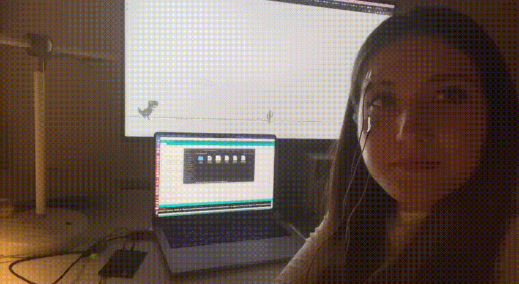
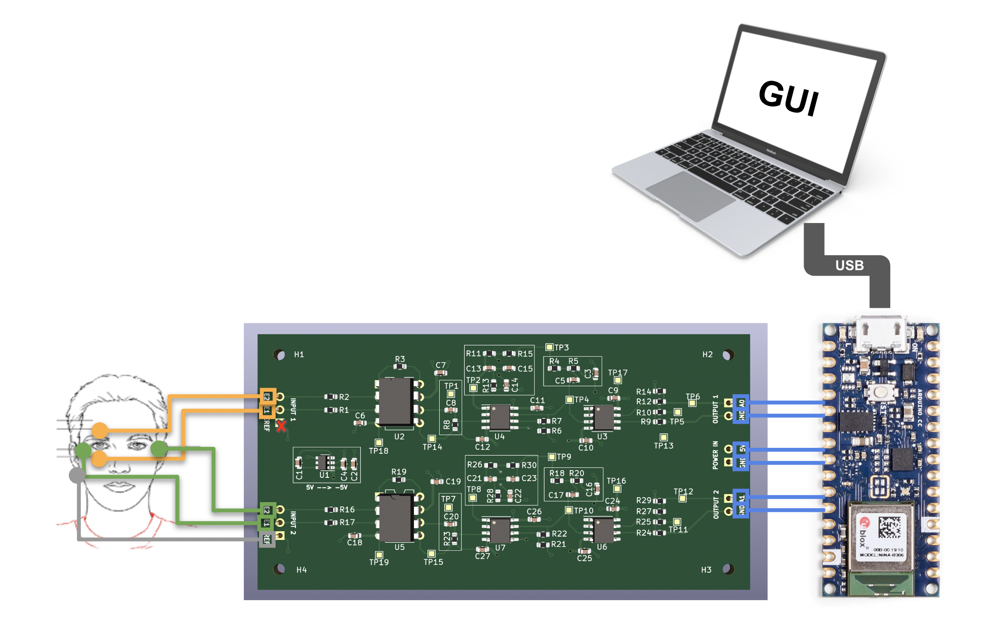

# eog-eye-tracking
Exploration of EOG (electrooculogram) signals as a potential human computer interface.

## Project Description
This project was one of [Neurotech@Berkeley](https://github.com/neurotech-berkeley)'s Devices Division projects in Spring 2022. At Devices, we build hardware for the brain - to measure and analyze electrical signals generated by our bodies to see if we can come up with new ways to interact with computers. You can learn more about our organization as a whole at [neurotech.berkeley.edu](https://neurotech.berkeley.edu/).

Inspired by the potential that the gaze-tracking systems, we set out to explore a technique with substantially lower computational cost than computer vision: electrooculography (EOG). Unlike computer vision that relies on cameras, EOG relies on intrintic electric signals generated in our eye.

In this project, we prototyped, designed, fabricated, and tested analog front end (AFE) circuit to control a dinosaur chrome game. 

## Demo

In this demo, we connected our custom-designed PCB to a laptop through an Arduino. The dinosaur is controlled by blinks alone, hands and keyboard-free.

## Function Diagram

In this initial setup, we use three electrodes (2 attaching above and below an eye, and 1 fore reference behind an ear). These electrodes then attach to our PCB that amplify and filter from noise the difference between the two electrodes. The PCB is able to output a voltage acceptable by most 5V-operated microcontrollers (like Arduino, for example). The output of one channel is just an analog voltage that can be read by an onboard ADC on a microcontroller, which then can get transmitted to a laptop through a USB port for real-time analysis.

## Next Steps
Here are some potential improvements and ideas that we want to incorporate in future iterations of the design:

### 1. Add bluetooth capabilities
Currently, the PCB is communicating to the laptop through USB cable, but it would be cool to make it wireless! Open to exploring bluetooth chips other than Arduino. This would potentially mean exploring power consumption of the device and including a charging circuit.

### 2. Replace fixed resistors/capacitors with tunable alternatives
Currently, the AFE of our PCB is configured specifically for EOG signals, but it would be cool to make it adjustable to other types of signals by incorporating tunable resistors/capacitors in filters.

### 3. Incorporate a pattern recognition algorithm
Currently, we tell the difference between looking up and down by using basic thresholding :P

### 4. Build a chrome extension
Moving away from playing games, we want to explore incorporating eye tracking into an every-day workflow!

### 5. Build a dashboard for observing the signal in real-time

